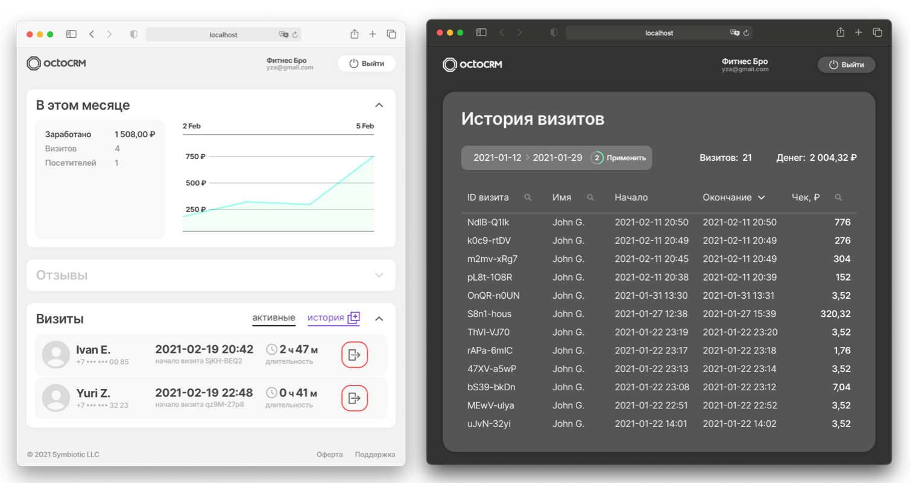

# How to set new partner + operator + place manually

## 1. Create new partner

1. Create new auth email/password user via Firebase Console (take UID for `partnerId`).
2. Create new partner profile in the `/partners` collection with UID for doc ID (consult the `Partner` model in `@yzalvov/octoshared-ts` for fields reference).

## 2. Create new place

1. Create new place in the `/places` collection. `title` and `partnerId` may be enough. If `isPublished` is not `true` place won't be on the map yet (consult the `Place` model in `@yzalvov/octoshared-ts` for fields reference).
2. Take the place doc ID for placeId.

## 3. Create new PartnerOperator

1. Create new auth email/password user via Firebase Console (take UID).
2. Create new operator profile in the `/partner-operators` collection with UID for doc ID (consult the `PartnerOperator` model in `@yzalvov/octoshared-ts` for fields reference).
3. Put `partnerId` (created above) and `places: [ placeId ]` to the operator profile.
4. `partnerId` and `places: [ placeId ]` by `setCustomClaimsOnOperatorUpdate` cloud function will be automatically set as Custom Claims for the operator `auth.user`. It will be used in `firestore.rules` so that in octoCRM operator might get payment records for his places only.

## Result of 1-3

Partner may have several places and several operators for octoCRM. Each operator may have access to several places. In octoCRM v.1 the first `placeId` of operator `places` is used by default.

# Use @yzalvov/octoshared-ts@latest GitHub Package for functions

- Cloud Functions are using private modules. [Details](https://cloud.google.com/functions/docs/writing/specifying-dependencies-nodejs)
